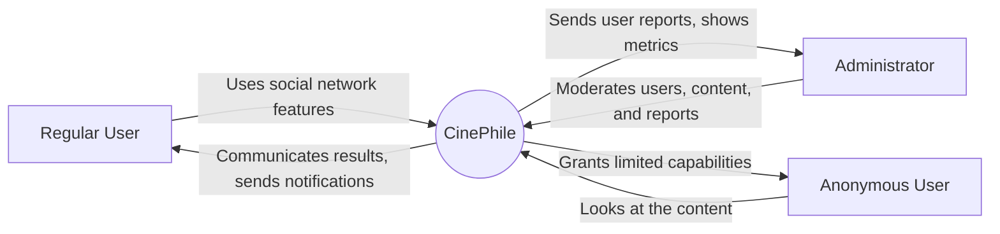
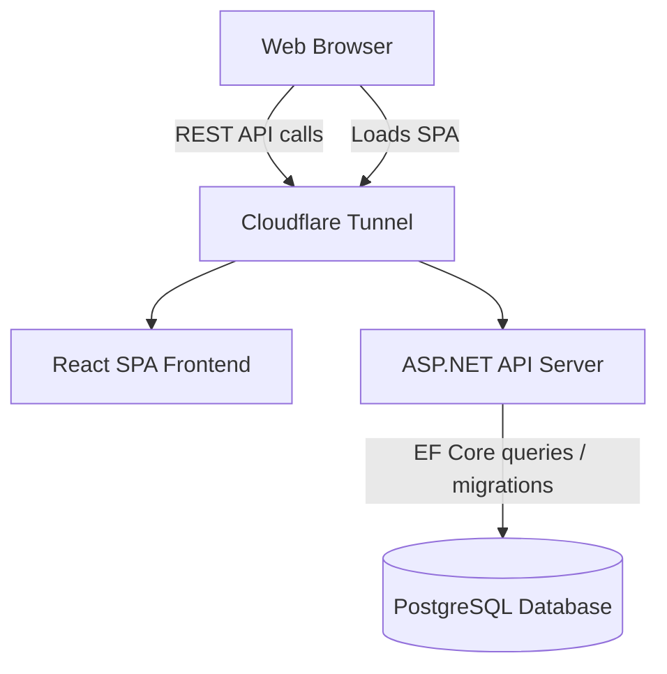
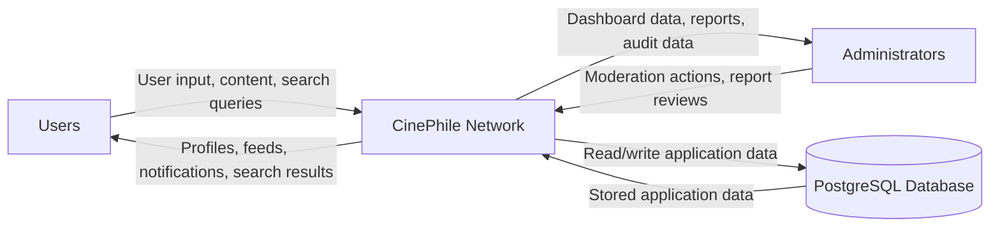
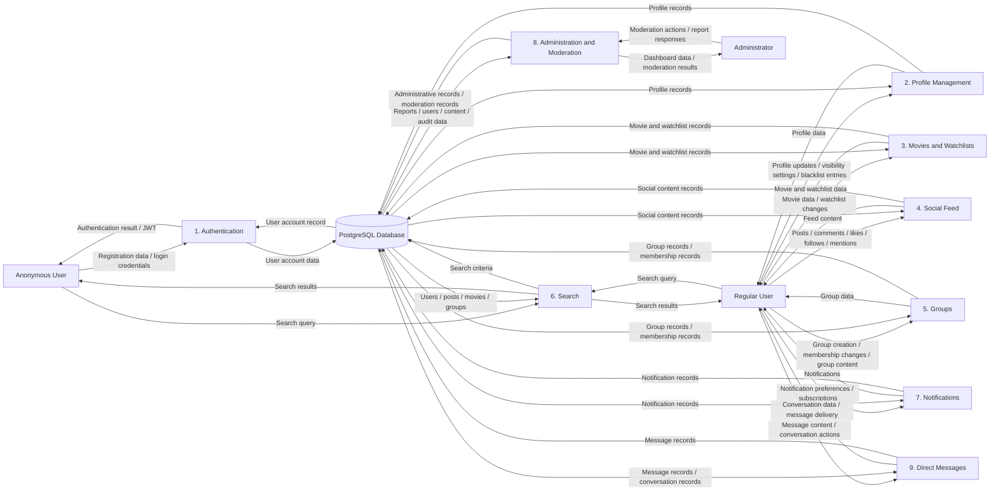
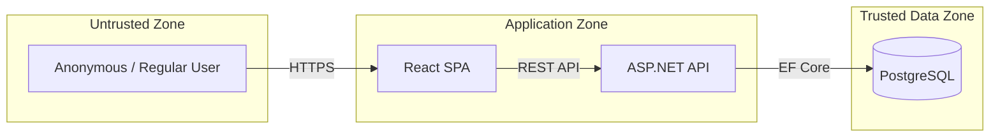
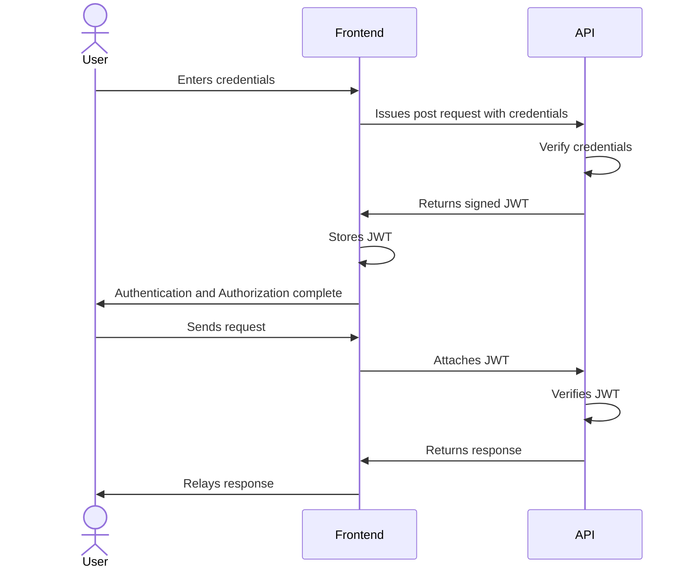

# Architecture Diagrams

## 1. System Context Diagram
Purpose:
Shows what external entities communicate with application and what is their relation to it.

## 2. Container Diagram
Purpose:
Shows runtime components and communication paths.

## 3. Data Flow Diagram
Purpose:
Shows how important data moves through the system.
### Level 0 DFD:

### Level 1 DFD:

## 4. Trust Boundary Diagram
Purpose:
Shows security boundaries between users, frontend, backend, and database.

## 5. Authentication Flow Diagram
Purpose:
Shows JWT-based authentication flow between frontend and backend.

